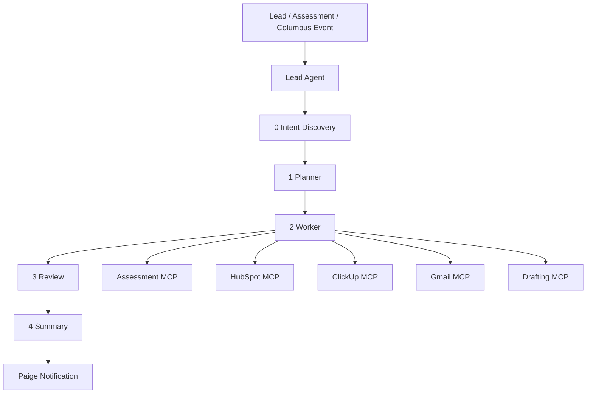

# 18 — Phase 2 and Phase 3 Roadmap

## Purpose

Do not build these in MVP, but design MVP so these become easier later.

## Phase 2 — Learning platform

### Modules

- LMS
- Course/lesson content
- Memberships
- Stripe
- Solomon Engine portal
- Knowledge base
- RAG
- Deeper CRM automation
- MCP-style integration wrappers

### Dependencies

- MVP site live
- CMS working
- Auth working
- Leads flowing
- First real data in HubSpot and ClickUp

## Phase 3 — Agent fleet

### Architecture

## MVP groundwork needed now

- Store structured lead data
- Add intent_type, segment, urgency, source, raw_input
- Use consistent API response format
- Keep integration events auditable
- Version prompts
- Export n8n workflows
- Avoid personal mailbox integration
- Create dedicated service account later for Gmail MCP

## Human-in-the-loop rule

No agent should send external client-facing communication without review until approval rules are documented and tested.
