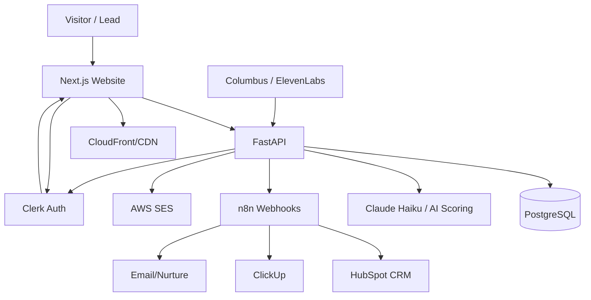

# 03 — Architecture

## Architecture style

Static content (hardcoded in code, no CMS), API-first, integration-ready web platform.

## High-level system



## Responsibility boundaries

### Next.js

- Presentation layer
- All page/blog content hardcoded in code (no CMS)
- Forms UI
- Assessment UI
- Lead portal UI
- SEO metadata rendering
- No AI calls
- No integration secrets
- No business decisions

### FastAPI

- Validation
- AI scoring
- Lead processing
- Assessment processing
- Webhooks
- Auth checks
- HubSpot / ClickUp / n8n integration triggering
- SES email
- Audit logging
- Report generation

### PostgreSQL

- Users
- Leads
- Assessments
- Reports
- Events
- Audit logs
- Integration states

### n8n

- Orchestrates cross-tool workflows
- Handles HubSpot / ClickUp / email automation
- Must not be the source of truth
- Must not be the only place where lead data exists

## Recommended monorepo

```txt
tbg-platform/
  apps/
    web/
    api/
  packages/
    ui/
    config/
    types/
    api-client/
  infra/
    aws/
    nginx/
    scripts/
  docs/
  workflows/
    n8n/
  .github/
    workflows/
  CLAUDE.md
  CODEX.md
  PROJECT_STATE.md
  EXECUTION_PLAN.md
```

## Deployment shape

```txt
Frontend:
  Next.js on Vercel or AWS Amplify/CloudFront

Backend:
  EC2 t3.micro
    - FastAPI on port 8000
    - Nginx reverse proxy

Database:
  RDS PostgreSQL

Media:
  S3 + CloudFront

Email:
  SES

Monitoring:
  Sentry + CloudWatch
```

## URL routing

```txt
/                    -> Next.js
/ai-fluency-cohort   -> Next.js page
/the-solomon-engine  -> Next.js page
/for-organizations   -> Next.js page
/our-ai-return       -> Next.js page
/resources           -> Next.js resource listing
/insights            -> Next.js blog listing
/insights/[slug]     -> Next.js blog detail
/contact             -> Next.js contact page
/dashboard           -> Next.js protected lead portal

/api/*               -> FastAPI
```

## Future agent-readiness

Every lead and assessment event should store:

- source
- raw_input
- intent_type
- segment
- urgency
- recommended_next_step
- structured_payload
- integration_status

This prepares Phase 3 agent workflows without reworking the data model.
