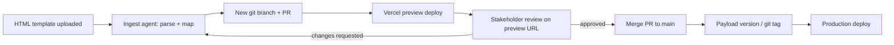

# 19 — Template Upload → Preview → Approve → Version Workflow

## Purpose

Sometimes a full-screen layout change comes in as an external HTML template (client, design vendor, agency). This doc plans how such a template gets turned into a reviewable, versioned change to the live site, without an agent unilaterally deciding what ships.

Expected cadence: roughly once a year (whole-site redesign), not a frequent workflow. Infra choices below are deliberately lean — no standing services kept running year-round just for this.

## Flow

## Pieces

### 1. Ingest agent

- Input: raw HTML (+ optional CSS/assets) for a page or section.
- Output: either
  - a new/updated Payload block schema + matching React component in `apps/web/components/cms`, wired into `BlockRenderer.tsx`, or
  - a full page override under `apps/web/app/[slug]` if the layout doesn't fit existing block model.
- Agent works on a dedicated branch (git worktree), does not touch `main` directly.
- Agent must not restyle/rewrite content decisions on its own — layout/structure only, matching the uploaded template as closely as feasible within Tailwind + existing design tokens.

### 2. Preview

- `apps/web` gets linked to Vercel for preview deploys only (production stays on current AWS-first infra per `09_AWS_INFRA.md` — this is not a prod hosting migration).
- Every branch/PR from the ingest agent gets an automatic Vercel preview URL.
- No standing staging Payload/Postgres instance (cadence too rare to justify always-on cost). At redesign time: `pg_dump` prod, restore into a temp Postgres (script under `infra/scripts`), point the Vercel preview env vars at it. Tear down after merge.

### 3. Review / approve

- Human reviews the Vercel preview URL directly (real rendered page, not a screenshot).
- Approval = normal PR approval on GitHub. No separate approval tool needed.
- Changes requested = agent iterates on same branch, new preview auto-updates.

### 4. Version + apply

- Merge to `main` triggers prod deploy through existing pipeline (unchanged).
- Content-level versioning already exists via Payload's draft/version system — no new infra needed there.
- Structural/layout versioning = git history + tags (e.g. `layout-v{n}`) on merge commits touching layout components.
- Rollback = revert merge commit or redeploy prior tag; Payload version history covers content-only rollback separately.

## What's new vs. what already exists

| Piece | Status |
|---|---|
| Payload draft/version system | Already exists, no work needed |
| Git PR review/approval | Already exists (GitHub), no work needed |
| Vercel preview deploys for `apps/web` | New — needs Vercel project linked, env vars mirrored from AWS config |
| Ingest agent (HTML → block/component) | New — build as Claude Code agent workflow, scoped to layout/structure only |
| Layout version tagging convention | New — lightweight, just a tag naming convention on merge |

## Decisions (locked)

- **Preview DB**: no standing staging instance. Temp Postgres restored from prod dump at redesign time, torn down after merge.
- **Trigger**: manual. Template dropped in `docs/templates/inbox/`, agent invoked by hand (Claude Code session). No watch-folder automation — event too infrequent to automate.
- **Scope**: whole-site, global layout swap, structure/layout only. Any JS behavior (carousels, tabs, etc.) in the source template gets flagged by the agent for a human to wire manually — not auto-implemented.

## Non-goals

- Agent does not re-decide product/content strategy (per repo's operating rule in `README.md`).
- No new custom approval-tracking tool — GitHub PR review is the approval system.
- Not a migration of prod hosting to Vercel — preview only.
